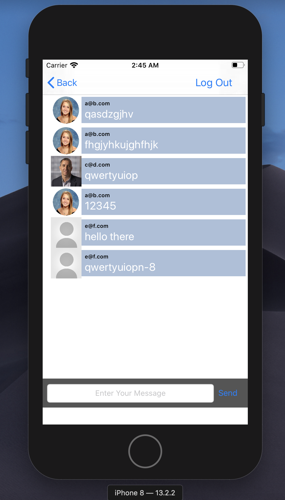
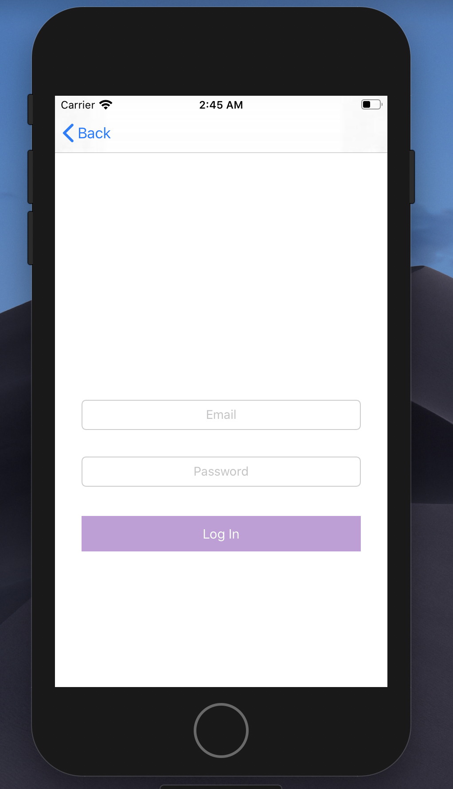
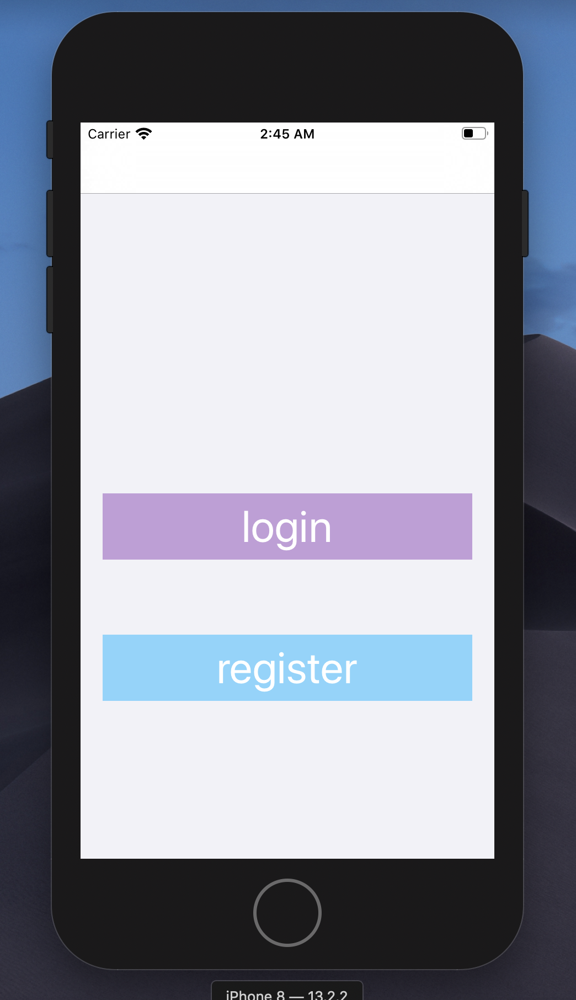

# Messenger App
this app mocks a messenger app 

## General info
* Each user can register themselves and login
* Then they can send messages in the communal chat
	
## Technologies
Project is created with:
* Custom tableview cell and button
* ProgressHUD
* Implements tableviews, and navigation view controller
* Firebase: user authentication, real time data
	
## What it looks like
###### message view

###### login view

###### home view

